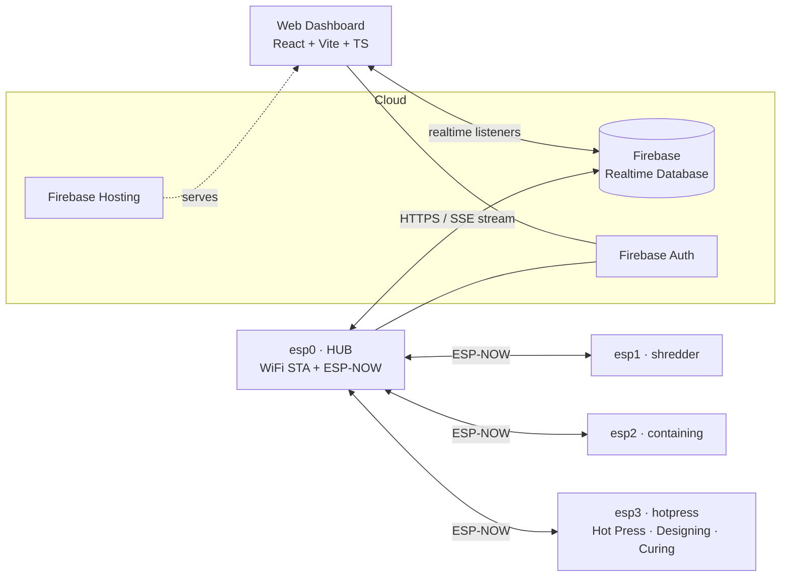
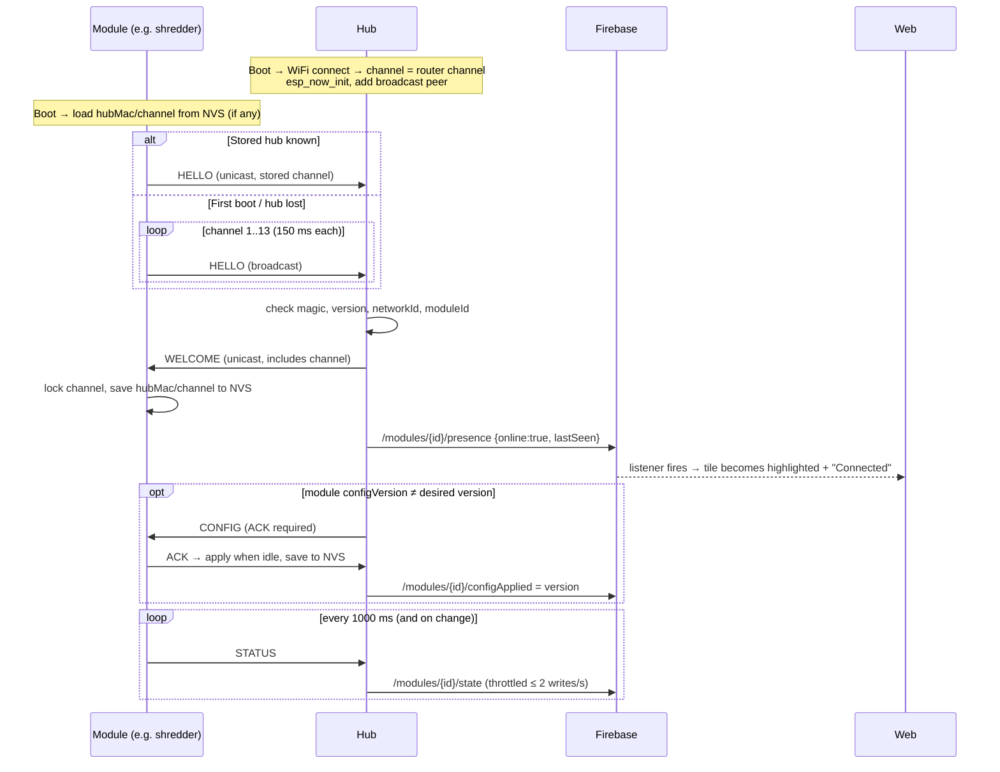

# Architecture

## 1. System overview



**Layers and responsibilities**

| Layer | Owns | Never does |
|---|---|---|
| Module ESP32 | Its I/O, its state machine, safety and local STOP, and its last config (NVS) | Talk to WiFi or Firebase. Depend on the hub to run. |
| Hub ESP32 | Pairing, presence tracking, translating Firebase JSON ↔ ESP-NOW binary, reliable delivery of config and commands | Run any process logic. Drive any actuator. |
| Firebase RTDB | Live state, desired config, command queue, event log | Hold secrets. |
| Web dashboard | Displays state. Edits config. Sends STOP/IDENTIFY/TARE/CALIBRATE/REBOOT. | START anything. |

## 2. Auto-pairing (no buttons)



**Rules**

- One device per `moduleId`. If a *different* MAC says HELLO with an existing `moduleId`, the hub
  accepts it as a **replacement** and logs event `MODULE_REPLACED`. This lets you swap a broken
  ESP32 with no setup.
- A HELLO with a wrong `magic`, `PROTOCOL_VERSION` or `networkId` is ignored. This stops a
  neighbour's devices from joining. A version mismatch is logged on the hub serial.

## 3. Presence (connected / disconnected)

| Who | Detects | How |
|---|---|---|
| Hub → module lost | No packet from module for **3500 ms** | Hub writes `presence.online=false` and logs event `MODULE_OFFLINE`. |
| Module → hub lost | **5 consecutive** unicast send failures (ESP-NOW MAC-level ACK) | Module goes back to channel-scan HELLO. Its process keeps running. |
| Web → hub lost | `now − /hub/lastSeen > 25 s` (hub writes `lastSeen` every 10 s) | Web shows **Hub offline** and greys out **all** tiles. Stale `online=true` values can't be trusted. |

A tile is shown **Connected** only when `hubOnline && modules/{id}/presence/online`.

## 4. Config flow (web → module)

1. The web writes `/modules/{id}/config` with `version = previous + 1` (RTDB transaction).
2. The hub sees the new version (it polls `config/version` every 3 s). It converts the JSON to the binary `CONFIG` payload and sends it
   with an ACK request (3 retries, 200 ms apart).
3. The module validates ranges. It ACKs `OK` or `REJECTED`, stores the config in NVS, and applies
   it **at the next idle point** (safety invariant 6).
4. The hub writes `/modules/{id}/configApplied = {version, result, at}`.
5. The web shows **Synced ✓** when `configApplied.version == config.version`, otherwise
   **Pending…** (or **Rejected**).
6. On every reconnect (HELLO with an old `configVersion`) the hub pushes the latest config again.

## 5. Command flow (web → module)

1. The web pushes `/commands/{moduleId|all}/{pushId} = {type, args, createdAt, by, status:"pending"}`.
2. The hub forwards a `COMMAND` (ACK required) and updates `status` to `sent`, then `done` or
   `failed`.
3. Allowed types: `STOP`, `IDENTIFY`, `TARE`, `CALIBRATE`, `REBOOT`. `moduleId = all` is only
   valid with `STOP`.
4. Commands older than 30 s when the hub sees them are marked `expired`, not executed. This
   prevents a replay after the hub reboots.

## 6. Failure behaviour

| Failure | Result |
|---|---|
| WiFi / internet down | Hub keeps ESP-NOW presence. Firebase writes are dropped. After reconnect the hub writes a full snapshot. Modules are unaffected. |
| Hub dead | Modules run standalone on their NVS config and keep re-scanning. The web shows Hub offline. |
| A module dead | Only that module stops. The others are unaffected. The web greys out its tile(s). |
| Router changes channel | The hub follows the router. Modules lose the hub, re-scan and re-pair automatically. |
| Firebase rules reject a write | The hub logs `[ERROR]` on serial. The web shows the error toast. |

## 7. Firmware structure (every board)

```
firmware/<board>/
  platformio.ini        ← pinned platform + libs, lib_extra_dirs = ../lib
  include/
    pins.h              ← pin map (mirrors docs/HARDWARE.md)
    config.h            ← compile-time defaults (used until NVS has a config)
  src/
    main.cpp            ← setup/loop: inputs → logic → outputs → display → link
    link.*              ← ESP-NOW client (pairing, heartbeat, ACK/retry), from TileProtocol
    state_machine.*     ← the module's behaviour (see docs/modules/<board>.md)
    display.*           ← OLED screens (U8g2)
    io.*                ← debounced buttons/switches, relay, buzzer / servo / load cell drivers
    settings.*          ← NVS load/save of config + pairing
```

Hub adds `firebase_bridge.*` (FirebaseClient + ArduinoJson) and `registry.*` (paired modules,
presence timers).

**Libraries (pinned in each platformio.ini)**: U8g2 (olikraus), Adafruit PWM Servo Driver
(PCA9685), robtillaart/HX711, mobizt/FirebaseClient, bblanchon/ArduinoJson, and the core
`esp_now.h`, `WiFi.h`, `Preferences.h`.

## 8. Web structure

```
web/src/
  main.tsx, App.tsx            ← router + providers
  lib/firebase.ts              ← init (env vars), auth, db exports
  shared/types/rtdb.ts         ← TypeScript mirror of docs/DATA_MODEL.md
  shared/hooks/                ← useHubStatus, useModule, useServerTime, useCommand
  components/                  ← UI primitives (Card, Toggle, Slider, StatusDot…)
  features/
    auth/                      ← login page, route guard
    dashboard/                 ← process line: 5 tiles, highlight + Connected indicator
    shredder/                  ← live state + config form
    containing/                ← 4 container cards, Loadcell/Time + Manual/Time sliders, calibration
    hotpress/                  ← live relays/switch state
    events/                    ← event log
```

## 9. Security

- RTDB rules: default deny. `admin` reads everything and writes `config` and new `commands`.
  `hub` writes `hub`, `presence`, `state`, `info`, `configApplied`, `events` and command `status`.
  See `firebase/database.rules.json`.
- The hub account password lives only in `firmware/hub/include/secrets.h` (git-ignored).
- ESP-NOW: `networkId` filtering now. Encrypted peers (PMK/LMK) come in Phase 7.
