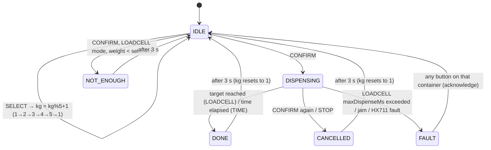

# Module: Containing (esp2)

Parts: 4 containers. Each has 4 load cells → 1 HX711, and 2 MG995 360° servos (screw extruder)
driven by 1 PCA9685. OLED SH1106. 2× SELECT + 2× CONFIRM buttons. 1 3-way selector. No buzzer.

| # | Container | Controlled by | Web mode slider |
|---|---|---|---|
| C1 | Raw HDPE | SELECT1 + CONFIRM1 | **Loadcell ↔ Time** |
| C2 | Raw PP | SELECT2 + CONFIRM2 | **Loadcell ↔ Time** |
| C3 | Mixed HDPE | Selector LEFT | **Manual ↔ Time** |
| C4 | Mixed PP | Selector RIGHT | **Manual ↔ Time** |

The selector's middle position = NEUTRAL = C3 and C4 stopped.

## Raw containers (C1, C2)



- Default selection **1 kg**. SELECT is ignored while dispensing.
- **LOADCELL mode**: `startWeight` is recorded, the servos run, and they stop when
  `startWeight − weight ≥ selectedKg×1000 − toleranceG`. Safety: stop with FAULT on
  `maxDispenseMs`, or when the weight hasn't dropped for `jamTimeoutMs`. The load cell is read
  with a moving average, because the screws vibrate.
- **TIME mode**: run for `timeTableMs[kg−1]`. The web lets you enter a time for **each** of
  1–5 kg, with a "fill linearly from 1 kg" helper. The weight is still measured and reported as
  `dispensedG` for comparison, which shows which mode is more accurate.
- C1 and C2 can dispense at the same time.

## Mixed containers (C3, C4)

| Mode | Behaviour |
|---|---|
| MANUAL | Runs **while** the selector is on its side. Stops when it returns to NEUTRAL. |
| TIME | On entering the side, runs for `runTimeMs`, then **DONE (hold)**. It won't run again until the selector goes back to NEUTRAL and then to the side again (re-arm). |

Selector LEFT ↔ RIGHT without NEUTRAL (a wiring glitch) is treated as passing through NEUTRAL.
Both LOW at once = wiring fault → NEUTRAL and fault flag set.

## STOP / safety

- Remote STOP (web) → all servos stopped, and PCA9685 OE set HIGH for 200 ms then re-enabled at
  stop pulse. Running containers → CANCELLED. The mixed selector must go back to NEUTRAL to re-arm.
- Power-up interlock: if the selector isn't NEUTRAL at boot → `SET SELECTOR TO MIDDLE`.
- Config changes apply per container only when that container is IDLE.

## OLED layout (128×64)

```
┌──────────────────────────────┐
│CONTAINING   ⇄hub  SEL:NEUTRAL│  status bar
│1 R-HDPE 12.4kg  [2kg] ▶▶▷ 40%│  C1: weight, selection, state/progress
│2 R-PP    8.1kg  [1kg] READY  │  C2
│3 M-HDPE  5.0kg  RUN 00:07    │  C3: TIME countdown / MANUAL "RUN"
│4 M-PP    3.2kg  STOP         │  C4
│L:LOADCELL  T:TIME  (modes)   │  footer: mode of each container
└──────────────────────────────┘
```

While a container is dispensing, its row animates (moving arrows plus a progress bar). DONE,
CANCELLED, JAM and NOT ENOUGH flash on that row for 3 s. The final pixel layout is tuned on the
real screen in Phase 5.

## Commands handled

`STOP`, `IDENTIFY` (OLED inverts and blinks for 3 s), `TARE c`, `CALIBRATE c grams`, `REBOOT`
(only when all containers are idle).
