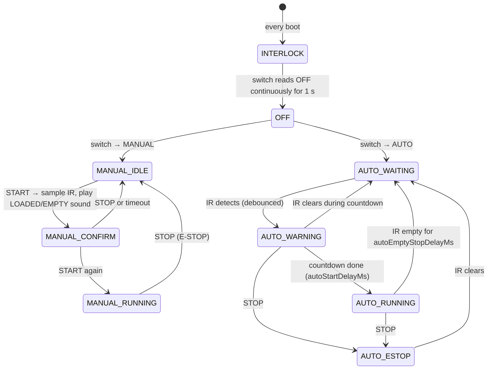

# Module: Shredder (esp1)

Parts: OLED SH1106, 3-way switch (AUTO / OFF / MANUAL), START, STOP (emergency), **passive**
buzzer module, relay (motor), IR sensor.

## States

Changing the switch position from **any** state turns the relay OFF right away and enters the new
mode's first state (OFF / MANUAL_IDLE / AUTO_WAITING).

| State | Relay | OLED (main line) |
|---|---|---|
| INTERLOCK | OFF | `SET SWITCH TO OFF` (only if the switch is not at OFF after 1 s; a normal boot shows OFF and unlocks silently) |
| OFF | OFF | `OFF` |
| MANUAL_IDLE | OFF | `MANUAL · Press START to check` |
| MANUAL_CONFIRM | OFF | `LOADED` or `EMPTY` (large) + `START=Run  STOP=Cancel` + timeout bar |
| MANUAL_RUNNING | **ON** | `RUNNING` + spinning blade + `STOP to halt` |
| AUTO_WAITING | OFF | `AUTO · Waiting for material` |
| AUTO_WARNING | OFF | `STARTING IN 5…4…3` (large countdown) |
| AUTO_RUNNING | **ON** | `AUTO RUNNING` + spinning blade + IR status |
| AUTO_ESTOP | OFF | `E-STOP · Clear material to reset` |

Top status bar on every screen: mode, IR ● / ○, and a link icon (hub connected / searching).

## Rules

- **STOP** (physical or remote) turns the relay OFF right away in every state. In MANUAL the next
  run needs the full START → check → START again. In AUTO it latches `AUTO_ESTOP` until the IR
  clears (kept from the legacy behaviour).
- MANUAL runs until STOP. The IR does **not** stop a manual run.
- In MANUAL_CONFIRM the run starts whether the chute was LOADED or EMPTY. The second START is the
  operator's deliberate confirmation.
- If the IR flickers during AUTO_RUNNING, the machine does not stop until it has been empty
  continuously for `autoEmptyStopDelayMs`.
- A config change from the web is applied only in OFF, MANUAL_IDLE or AUTO_WAITING.

## Sounds (passive buzzer, tones through LEDC)

| Event | Sound |
|---|---|
| Boot | C-E-G rising chime |
| START / button click | 1 short 2 kHz tick |
| **LOADED** (IR detects) | **Two high rising tones** 1.5 kHz → 2.5 kHz, 2× |
| **EMPTY** (IR clear) | **One long low falling tone** 800 Hz → 400 Hz |
| AUTO warning countdown | 2 kHz beep every 1 s, every 0.25 s in the last second |
| Relay ON | 1 s rising sweep |
| Relay OFF | short falling sweep |
| STOP / E-STOP | 3 fast 3 kHz alarm pulses |
| Mode change | 2 medium beeps |
| Running heartbeat | quiet 1 kHz tick every 4 s |
| IDENTIFY (remote) | alternating 1 kHz / 2 kHz for 3 s |

Uses the legacy non-blocking **queued pattern player**, extended with a frequency per step.

## Input filtering and noise (fw 0.2.2 – 0.2.4)

- Every input (3-way switch AUTO/MANUAL contacts, START, STOP, IR) goes through the shared
  **integrating filter** (lib/TileIO `IntegratingFilter`): the score moves ±1 per ms and the
  value only changes at the ends of the window, so short spikes can't flip it.
- Filter windows come from the web config (fw 0.2.4): `switchDebounceMs` (default 250, 20..2000)
  for both switch contacts, `buttonDebounceMs` (default 50, 10..500, kept short so STOP stays
  fast) for START/STOP, `irDebounceMs` for the IR sensor. They are applied when the config is
  applied (idle only, like every config change).
- This is a software workaround for the weak internal pull-ups: in the hardware test the switch
  contacts dropped out for more than 100 ms. Recommended hardware fix: 3.3 kΩ pull-up to 3.3 V +
  100 nF to GND on GPIO25, 26, 32 and 33.
- A **noise monitor** (lib/TileIO `PinNoiseMonitor`) counts edges per second and sets a fault bit
  for 10 s after a noisy second. Fault bits: 0x01 switch wiring (both contacts closed), 0x02 OLED
  missing, 0x04 START noisy, 0x08 STOP noisy, 0x10 switch AUTO contact noisy, 0x20 switch MANUAL
  contact noisy, 0x40 IR noisy. The web Devices list shows them by name.

## Power-up interlock (fw 0.2.1)

Every boot starts in `INTERLOCK`. It unlocks only after the switch has read **OFF continuously for
1 s** (`INTERLOCK_OFF_HOLD_MS`). A single first reading is never trusted: in the hardware test the
switch read OFF for an instant at power-up while it was on AUTO, and fw 0.2.0 skipped the interlock
and went straight to AUTO. Verified on the board: switch at OFF → silent unlock after 1 s; switch at
AUTO → "SET SWITCH TO OFF" until turned to OFF.

Note: this board is also powered from another source (relay or sensor wiring). Unplugging USB alone
may not restart it. Use the EN/RST button for a real restart.
